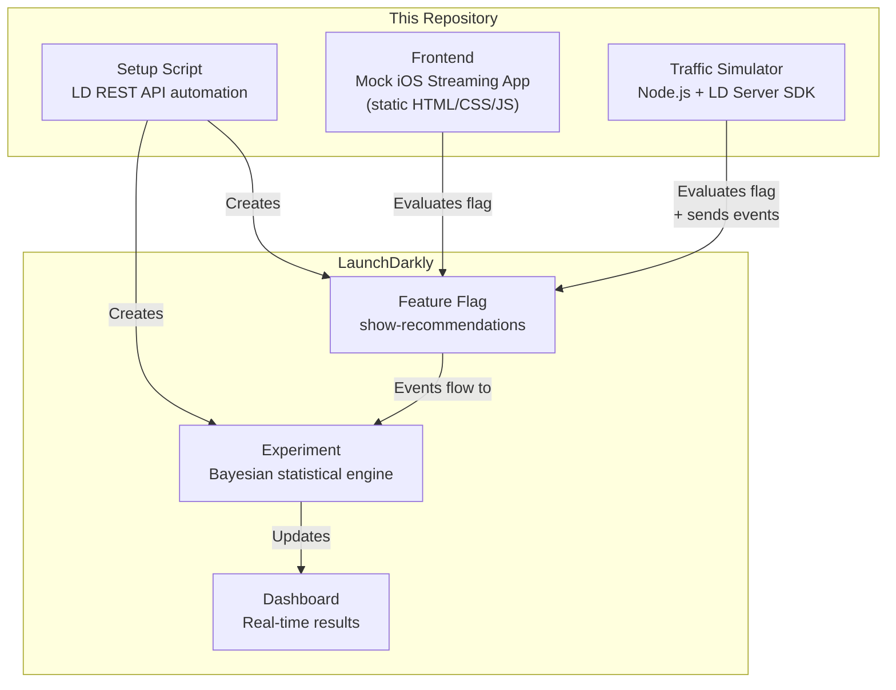
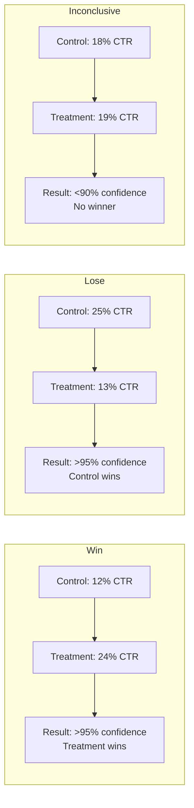
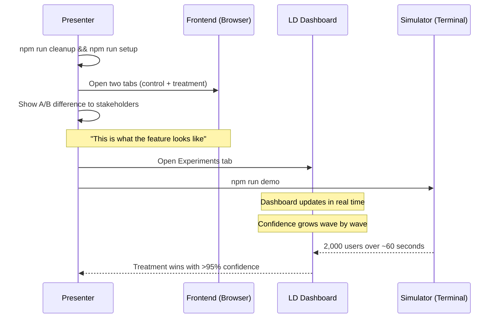

# LaunchDarkly A/B Testing Proof-of-Concept

Demonstrates how an iOS streaming app (live streams + curated content) integrates with LaunchDarkly for statistically rigorous A/B testing. Built to showcase real-time experiment dashboards to stakeholders.

## What This Proves

- Feature flags control UI rendering (recommendations row on/off)
- Simulated traffic produces real statistical results on the LD dashboard
- Three experiment outcomes: **treatment wins**, **treatment loses**, **inconclusive**
- Dashboard updates in real time during a live presentation

## Architecture



## Experiment Scenarios



| Scenario | Control Rate | Treatment Rate | Users | Expected Outcome |
|----------|-------------|---------------|-------|-----------------|
| `win` | 12% | 24% | 2,000 | Treatment wins decisively |
| `lose` | 25% | 13% | 2,000 | Control wins (treatment hurts) |
| `inconclusive` | 18% | 19% | 2,000 | No significant difference |

**Important:** Each scenario needs its own experiment. Run `npm run cleanup` then `npm run setup` between scenarios to get clean results. For a meeting, the `win` scenario is the most impressive to demo live.

## Prerequisites

- Node.js 24+ (see `.nvmrc`)
- A [LaunchDarkly](https://launchdarkly.com/) account (free trial works)

## Quick Start

### 1. Install

```bash
nvm use
npm install
```

### 2. Configure LaunchDarkly

```bash
cp .env.example .env
```

#### Get your keys from the LD Dashboard

1. **SDK Key + Client-side ID**: Go to **Settings → Projects → Your Project → Environments → test**
   - Copy the **SDK key** (starts with `sdk-`) → paste as `LD_SDK_KEY`
   - Copy the **Client-side ID** → paste as `LD_CLIENT_SIDE_ID`

2. **API access token**: Go to **Account Settings → Authorization → Access Tokens**
   - Create a new token — **do NOT check** "Service token" (use a personal token)
   - Give it **Writer** role
   - Copy the token → paste as `LD_API_KEY`

3. **Project key**: Check your dashboard URL — e.g. `app.launchdarkly.com/projects/default/...` means the key is `default`

Your `.env` should look like:

```
LD_SDK_KEY=sdk-xxxxxxxx-xxxx-xxxx-xxxx-xxxxxxxxxxxx
LD_CLIENT_SIDE_ID=xxxxxxxxxxxxxxxxxxxxxxxx
LD_API_KEY=api-xxxxxxxx-xxxx-xxxx-xxxx-xxxxxxxxxxxx
LD_PROJECT_KEY=default
LD_ENVIRONMENT_KEY=test
```

### 3. Set Up LaunchDarkly Resources

```bash
npm run setup
```

This automatically creates via the REST API:
- Feature flag: `show-recommendations` (boolean, 50/50 rollout)
- Metric: `content-clicked` (custom conversion)
- Experiment: timestamped (e.g. `rec-engagement-2026-03-28-14_30`)

The flag and metric are created once and reused. Each `setup` creates a new timestamped experiment.

### 4. Run the Simulation

**For a live presentation** (staggered, updates dashboard in real time):
```bash
npm run demo
```

**Run a specific scenario:**
```bash
npm run simulate:win
npm run simulate:lose
npm run simulate:inconclusive
```

**Custom options:**
```bash
node src/run.js --scenario=win --staggered --wave-size=50 --delay=5000
```

| Flag | Default | Description |
|------|---------|-------------|
| `--scenario` | `win` | Which scenario: `win`, `lose`, `inconclusive`, `all` |
| `--staggered` | off | Send users in waves with delays (for live demos) |
| `--wave-size` | 100 | Users per wave in staggered mode |
| `--delay` | 3000 | Milliseconds between waves |

### 5. View the Frontend Demo

```bash
npm run serve
```

Open `http://localhost:3000?clientId=YOUR_CLIENT_SIDE_ID` (use the `LD_CLIENT_SIDE_ID` value from your `.env`).

#### Showing A/B Side by Side

To demonstrate both variations to stakeholders, open two browser tabs:

- **Control (no recommendations):** `http://localhost:3000?clientId=YOUR_ID&variation=control`
- **Treatment (with recommendations):** `http://localhost:3000?clientId=YOUR_ID&variation=treatment`

The `variation` parameter forces the UI into a specific state regardless of what LD assigns. Without it, LD decides which variation the user sees based on the flag's 50/50 rollout.

Clicking any content tile sends a `content-clicked` event to LD, visible in the experiment dashboard.

### 6. Cleanup Between Runs

Each scenario needs a fresh experiment. To reset:

```bash
npm run cleanup
npm run setup
```

`cleanup` archives all active experiments. `setup` creates a fresh timestamped one. The flag and metric are reused across runs.

**Manual stop required:** If an experiment is currently running, you must **stop it from the LD dashboard UI** before cleanup can archive it. This is a LaunchDarkly API limitation — stopping an experiment requires selecting a "winning treatment", which the API only accepts as a treatment ID from a properly configured iteration. The cleanup script handles archiving, but the stop must be done manually:

1. Go to **Experiments → your experiment**
2. Click **Stop iteration** → select any winner
3. Then run `npm run cleanup` to archive it

## Verifying Events in the Dashboard

After running a simulation, you can verify events are arriving:

1. **Live events**: Go to **Flags → show-recommendations → Audience** (in the `test` environment). You should see user contexts appearing within seconds.

2. **Experiment results**: Go to **Experiments → your experiment**. Results take **15-30 minutes** to appear after the first events arrive. LD's Bayesian engine processes events in batches, not in real time. On trial plans, this may take longer.

3. **What to look for in the results**:
   - **Conversion rate** per variation (control vs treatment)
   - **Probability to beat baseline** — this is the key number, it grows toward 95%+
   - **Credible interval** — narrows as more data arrives
   - **"Winner" badge** — appears when confidence exceeds the threshold (default 95%)

4. **If you see "0 user contexts"**: Make sure the environment dropdown at the top of the dashboard says **test** (not production). The SDK key in `.env` must match the same environment.

## Docker

```bash
# Start the frontend
docker compose up frontend

# Run a simulation
docker compose run --rm simulator --scenario=win --staggered
```

## Deploy Frontend to Vercel

```bash
npx vercel --prod
```

Then open the deployed URL with `?clientId=YOUR_CLIENT_SIDE_ID`.

## Meeting Day Workflow



### Step-by-step

1. **30 minutes before the meeting**: Run `npm run cleanup && npm run setup` then `npm run demo` — this gives LD time to process the data before you present
2. **Show the frontend**: Open two tabs side by side with `?variation=control` and `?variation=treatment` to show the A/B difference
3. **Verify events arrived**: Go to **Flags → show-recommendations → Audience** — you should see user contexts
4. **Show the experiment results**: Go to **Experiments → your experiment** — by now the results should be populating with confidence intervals
5. **Run a second simulation live** (optional): Run `npm run simulate:win` during the meeting for the "watch it happen" effect — the numbers in the experiment will update
6. **Declare winner**: Point out the probability to beat baseline exceeding 95%

### Talking points

1. **"Here's what the feature looks like"** — show control vs treatment tabs
2. **"This is instant, no deploy"** — toggle the flag in LD, watch the UI update
3. **"Now let's simulate 2,000 real users"** — start the simulator
4. **"Watch the confidence grow"** — dashboard updates live
5. **"Not every experiment wins"** — mention the lose and inconclusive scenarios exist
6. **"LD tells us when we don't have enough data"** — statistical rigor, not gut feeling

## Available Scripts

| Command | Description |
|---------|-------------|
| `npm run setup` | Create flag, metric, and timestamped experiment in LD |
| `npm run cleanup` | Archive all active experiments (flag and metric kept) |
| `npm run demo` | Run `win` scenario in staggered mode (for presentations) |
| `npm run simulate:win` | Simulate treatment winning (burst mode) |
| `npm run simulate:lose` | Simulate treatment losing (burst mode) |
| `npm run simulate:inconclusive` | Simulate inconclusive result (burst mode) |
| `npm run serve` | Serve the frontend on port 3000 |

## Project Structure

```
launch-darkly-poc/
├── src/
│   ├── config.js         # Environment variables and flag/metric keys
│   ├── context.js        # User context generation (device simulation)
│   ├── client.js         # LD server SDK wrapper
│   ├── api.js            # Shared LD REST API utilities
│   ├── scenarios.js      # Three scenario definitions (pure data)
│   ├── simulator.js      # Core simulation engine (functional)
│   ├── logger.js         # Console output formatting
│   ├── setup.js          # LD resource creation via REST API
│   ├── cleanup.js        # LD resource teardown (archive experiments)
│   └── run.js            # CLI entry point (imperative shell)
├── frontend/
│   ├── index.html        # Mock iOS streaming app
│   ├── style.css         # iOS-inspired styling
│   └── app.js            # LD client SDK integration
├── docs/
│   ├── architecture.md   # System design and data flow diagrams
│   ├── ab-testing-math.md # Bayesian statistics and sample size math
│   ├── bucket-assignment.md # How LD assigns users to variations
│   └── success-criteria.md  # Production vs PoC metrics and limitations
├── Dockerfile            # Simulator container
├── Dockerfile.frontend   # Frontend container (nginx)
├── docker-compose.yml    # Multi-service setup
├── vercel.json           # Vercel deployment config
├── .env.example          # Required environment variables
├── .nvmrc                # Node.js version
└── package.json
```

## Documentation

| Document | What It Covers |
|----------|---------------|
| [Architecture](docs/architecture.md) | System design, data flow, component responsibilities |
| [A/B Testing Math](docs/ab-testing-math.md) | Bayesian inference, sample size formulas, worked examples |
| [Bucket Assignment](docs/bucket-assignment.md) | How LD's hashing algorithm assigns users to variations |
| [Success Criteria](docs/success-criteria.md) | Production metrics vs PoC metrics, known limitations |
