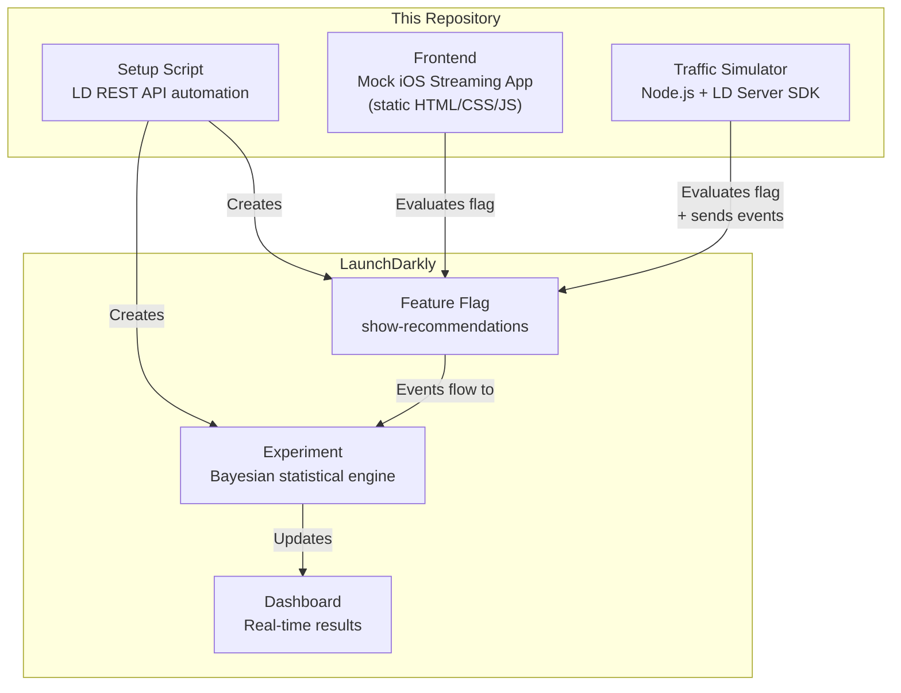
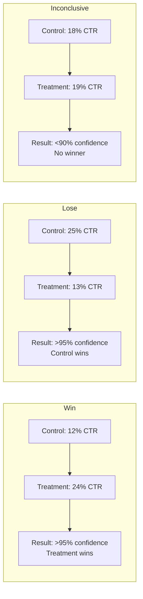
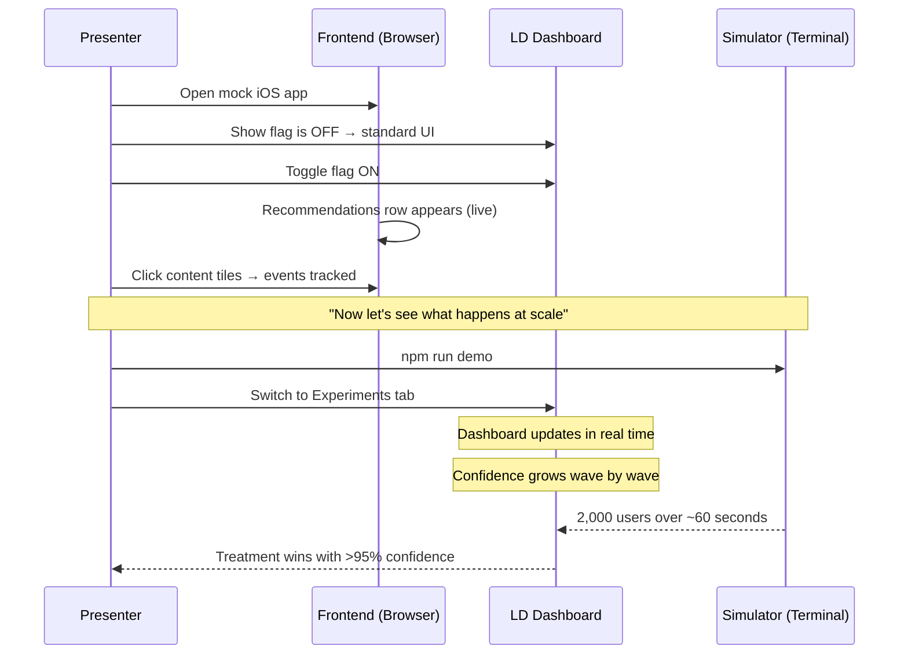

# LaunchDarkly A/B Testing Proof-of-Concept

Demonstrates how an iOS streaming app (live streams + curated content) integrates with LaunchDarkly for statistically rigorous A/B testing. Built to showcase real-time experiment dashboards to stakeholders.

## What This Proves

- Feature flags control UI rendering (recommendations row on/off)
- Simulated traffic produces real statistical results on the LD dashboard
- Three experiment outcomes: **treatment wins**, **treatment loses**, **inconclusive**
- Dashboard updates in real time during a live presentation

## Architecture



## Experiment Scenarios



| Scenario | Control Rate | Treatment Rate | Users | Expected Outcome |
|----------|-------------|---------------|-------|-----------------|
| `win` | 12% | 24% | 2,000 | Treatment wins decisively |
| `lose` | 25% | 13% | 2,000 | Control wins (treatment hurts) |
| `inconclusive` | 18% | 19% | 2,000 | No significant difference |

## Prerequisites

- Node.js 24+ (see `.nvmrc`)
- A [LaunchDarkly](https://launchdarkly.com/) account (free trial works)
- An API access token with `writer` scope

## Quick Start

### 1. Install

```bash
nvm use
npm install
```

### 2. Configure

```bash
cp .env.example .env
```

Edit `.env` with your LaunchDarkly credentials:

| Variable | Where to Find |
|----------|--------------|
| `LD_SDK_KEY` | Dashboard → Settings → Projects → Your Environment → SDK Key |
| `LD_CLIENT_SIDE_ID` | Same page → Client-side ID |
| `LD_API_KEY` | Dashboard → Account Settings → Authorization → Create Token (writer scope) |
| `LD_PROJECT_KEY` | Your project key (default: `launch-darkly-poc`) |
| `LD_ENVIRONMENT_KEY` | Your environment key (default: `production`) |

### 3. Set Up LaunchDarkly Resources

```bash
npm run setup
```

This automatically creates via the REST API:
- Feature flag: `show-recommendations` (boolean, 50/50 rollout)
- Metric: `content-clicked` (custom conversion)
- Experiment: "Recommendations Row Engagement" (links flag to metric)

### 4. Run the Simulation

**For a live presentation** (staggered, updates dashboard in real time):
```bash
npm run demo
```

**Run a specific scenario:**
```bash
npm run simulate:win
npm run simulate:lose
npm run simulate:inconclusive
```

**Run all three scenarios:**
```bash
npm run simulate:all
```

**Custom options:**
```bash
node src/run.js --scenario=win --staggered --wave-size=50 --delay=5000
```

| Flag | Default | Description |
|------|---------|-------------|
| `--scenario` | `win` | Which scenario: `win`, `lose`, `inconclusive`, `all` |
| `--staggered` | off | Send users in waves with delays (for live demos) |
| `--wave-size` | 100 | Users per wave in staggered mode |
| `--delay` | 3000 | Milliseconds between waves |

### 5. View the Frontend Demo

```bash
npm run serve
```

Open `http://localhost:3000?clientId=YOUR_CLIENT_SIDE_ID`

This shows a mock iOS streaming app that:
- Evaluates the feature flag on load
- Shows/hides the recommendations row based on the variation
- Tracks click events to the LD experiment
- Updates in real time when the flag is toggled

## Docker

```bash
# Start the frontend
docker compose up frontend

# Run a simulation
docker compose run --rm simulator --scenario=win --staggered
```

## Deploy Frontend to Vercel

```bash
npx vercel --prod
```

Then open the deployed URL with `?clientId=YOUR_CLIENT_SIDE_ID`.

## Presentation Flow



**Suggested talking points during the demo:**

1. **Show the frontend** — "Here's what the feature looks like. Notice the recommendations row appears when the flag is on."
2. **Toggle the flag** — "This is instant, no deploy needed. We can turn features on/off for any segment."
3. **Start the simulator** — "Now let's simulate what happens with 2,000 real users."
4. **Watch the dashboard** — "See the confidence interval narrowing in real time. The treatment is winning."
5. **Show the lose scenario** — "Not every experiment wins. Here's what it looks like when the feature hurts engagement."
6. **Show inconclusive** — "And sometimes we just don't have enough data to know. LD tells us that too."

## Project Structure

```
launch-darkly-poc/
├── src/
│   ├── config.js         # Environment variables and flag/metric keys
│   ├── context.js        # User context generation (device simulation)
│   ├── client.js         # LD server SDK wrapper
│   ├── scenarios.js      # Three scenario definitions (pure data)
│   ├── simulator.js      # Core simulation engine (functional)
│   ├── logger.js         # Console output formatting
│   ├── setup.js          # LD resource creation via REST API
│   └── run.js            # CLI entry point (imperative shell)
├── frontend/
│   ├── index.html        # Mock iOS streaming app
│   ├── style.css         # iOS-inspired styling
│   └── app.js            # LD client SDK integration
├── docs/
│   ├── architecture.md   # System design and data flow diagrams
│   ├── ab-testing-math.md # Bayesian statistics and sample size math
│   ├── bucket-assignment.md # How LD assigns users to variations
│   └── success-criteria.md  # Production vs PoC metrics and limitations
├── Dockerfile            # Simulator container
├── Dockerfile.frontend   # Frontend container (nginx)
├── docker-compose.yml    # Multi-service setup
├── vercel.json           # Vercel deployment config
├── .env.example          # Required environment variables
├── .nvmrc                # Node.js version
└── package.json
```

## Documentation

| Document | What It Covers |
|----------|---------------|
| [Architecture](docs/architecture.md) | System design, data flow, component responsibilities |
| [A/B Testing Math](docs/ab-testing-math.md) | Bayesian inference, sample size formulas, worked examples |
| [Bucket Assignment](docs/bucket-assignment.md) | How LD's hashing algorithm assigns users to variations |
| [Success Criteria](docs/success-criteria.md) | Production metrics vs PoC metrics, known limitations |
