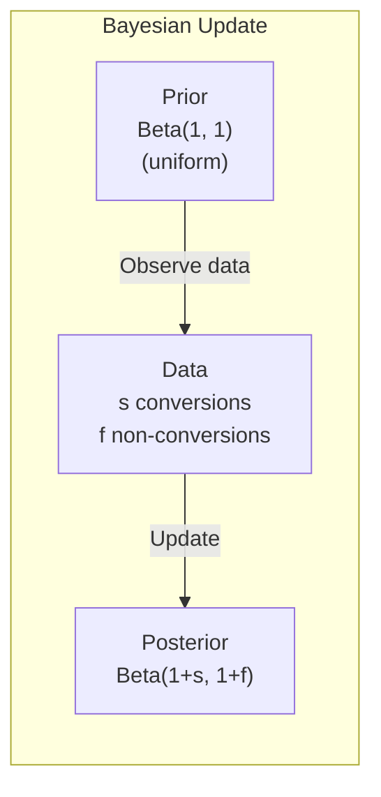
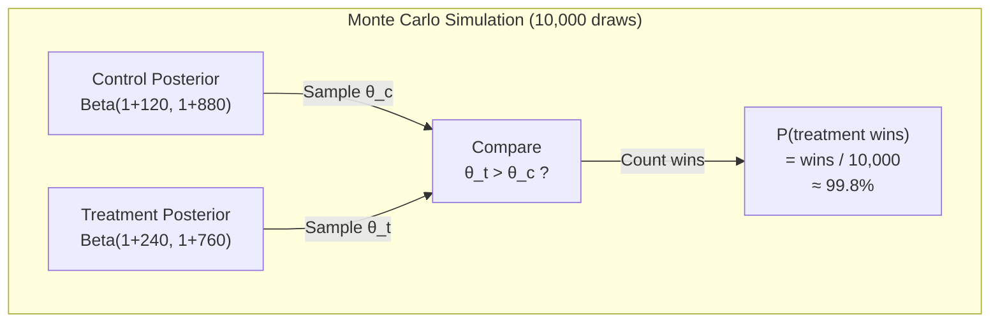

# The Math Behind A/B Testing

## How LaunchDarkly's Statistical Engine Works

LaunchDarkly uses **Bayesian inference** (not frequentist hypothesis testing) to evaluate experiments. This is a key distinction that affects how results are interpreted.

### Frequentist vs Bayesian

| Aspect | Frequentist (traditional) | Bayesian (LaunchDarkly) |
|--------|--------------------------|------------------------|
| Core question | "What's the probability of this data, given no effect?" | "What's the probability of an effect, given this data?" |
| Output | p-value, confidence interval | Posterior probability, credible interval |
| Sample size | Must be fixed in advance | Can peek at results anytime |
| Peeking problem | Inflates false positive rate | No peeking penalty |
| Interpretation | "95% CI" means: if we repeat this 100x, 95 intervals contain the true value | "95% credible interval" means: 95% probability the true value is in this range |

### The Bayesian Model

For conversion metrics (like our "content-clicked"), LaunchDarkly models each variation's conversion rate as a **Beta distribution**:

```
Prior:     Beta(α₀, β₀)     — typically Beta(1, 1) = uniform
Posterior: Beta(α₀ + s, β₀ + f)
           where s = successes (conversions), f = failures (non-conversions)
```



### Probability to Beat Baseline

LaunchDarkly computes **P(treatment > control)** using Monte Carlo sampling:

1. Draw N samples from the posterior of the control: `θ_control ~ Beta(1 + s_c, 1 + f_c)`
2. Draw N samples from the posterior of the treatment: `θ_treatment ~ Beta(1 + s_t, 1 + f_t)`
3. Count how often `θ_treatment > θ_control`
4. That proportion is the "probability to beat baseline"



### Worked Example: Our "Win" Scenario

Given our simulation parameters:
- **Control**: 12% conversion rate, ~1000 users → ~120 conversions
- **Treatment**: 24% conversion rate, ~1000 users → ~240 conversions

**Posteriors**:
- Control: `Beta(121, 881)` → mean ≈ 0.121, std ≈ 0.010
- Treatment: `Beta(241, 761)` → mean ≈ 0.241, std ≈ 0.014

The probability that treatment > control is **>99.99%** — a decisive win.

### When Does LD Declare a Winner?

LaunchDarkly shows results as soon as data arrives but uses **credible intervals** to indicate certainty:

- **< 90% probability**: "Not enough data" — inconclusive
- **90–95%**: "Likely winner" — moderate confidence
- **> 95%**: "Winner" — high confidence (default threshold)

The threshold is configurable per experiment.

### Sample Size and Statistical Power

The number of users needed depends on:

1. **Baseline conversion rate** — higher baselines need fewer samples
2. **Minimum detectable effect (MDE)** — smaller effects need more samples
3. **Desired confidence** — higher confidence needs more samples

Rough formula for a two-proportion test:

```
n ≈ (Z_α + Z_β)² × [p₁(1-p₁) + p₂(1-p₂)] / (p₂ - p₁)²

Where:
  Z_α = 1.96 (for 95% confidence)
  Z_β = 0.84 (for 80% power)
  p₁  = control conversion rate
  p₂  = treatment conversion rate
```

For our scenarios:

| Scenario | p₁ | p₂ | MDE | Required n (per arm) | Our n |
|----------|-----|-----|-----|---------------------|-------|
| Win | 0.12 | 0.24 | +100% | ~150 | 1000 |
| Lose | 0.25 | 0.13 | -48% | ~120 | 1000 |
| Inconclusive | 0.18 | 0.19 | +5.6% | ~22,000 | 1000 |

The "inconclusive" scenario intentionally uses far fewer users than needed to detect a 1% difference — that's what makes it inconclusive.

### Confidence Interval Width

The 95% credible interval width for a Beta posterior is approximately:

```
width ≈ 2 × 1.96 × √(p(1-p)/n)
```

With 1000 users per arm and p ≈ 0.20:
```
width ≈ 2 × 1.96 × √(0.20 × 0.80 / 1000) ≈ ±2.5%
```

This means if we observe 20% conversion, the true rate is likely between 17.5% and 22.5%.
