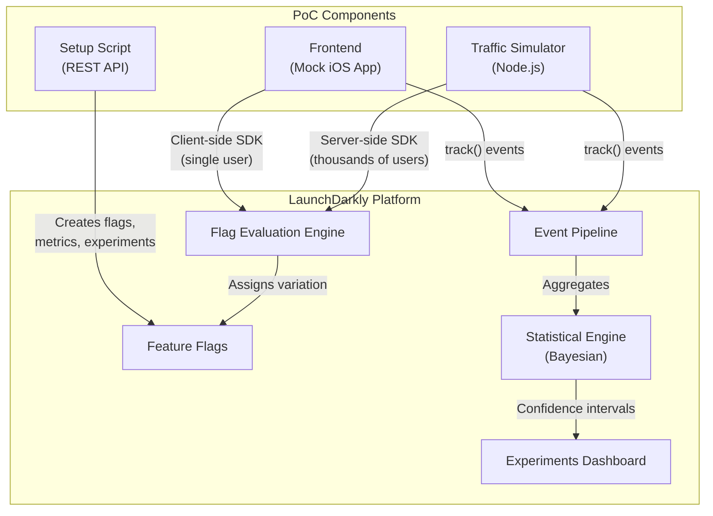
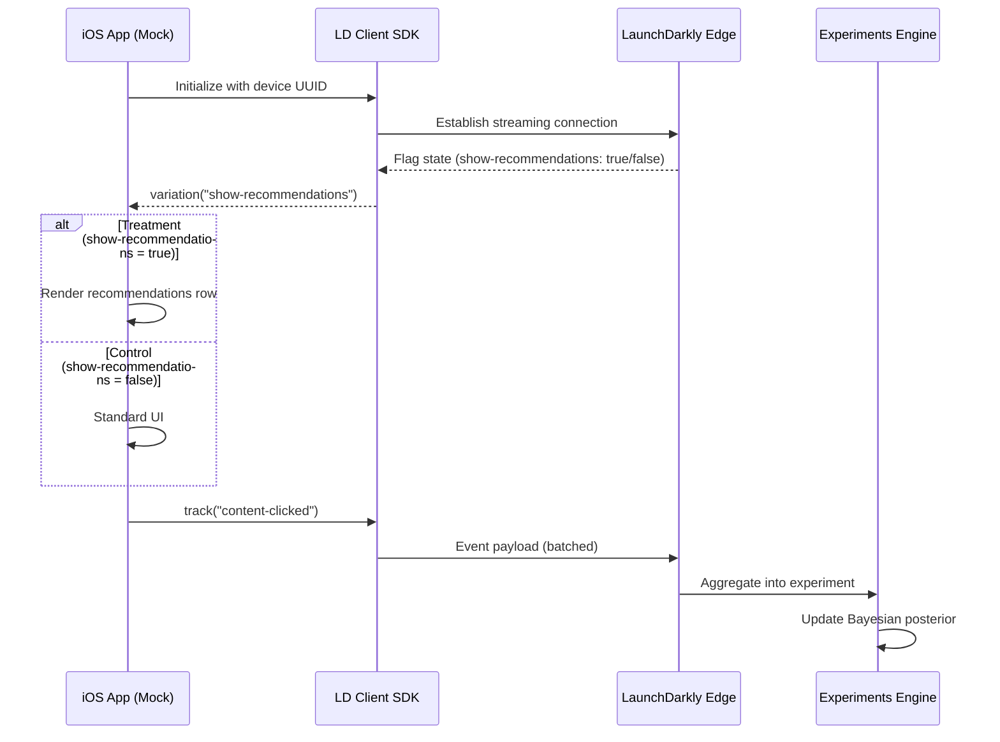
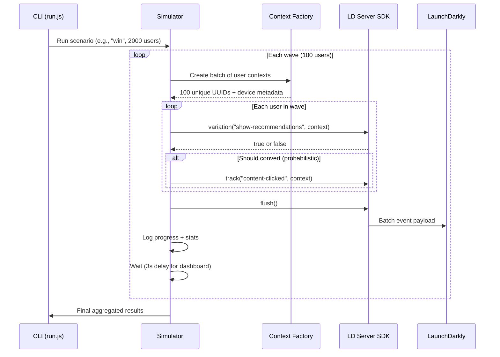

# Architecture

## System Overview

The PoC consists of three components working together to demonstrate LaunchDarkly's A/B testing capabilities in the context of an iOS streaming app.

## Data Flow: Single User Session

## Traffic Simulator Flow

## Component Responsibilities

| Component | Role | SDK | Purpose |
|-----------|------|-----|---------|
| `src/setup.js` | Control plane | REST API | Creates flags, metrics, experiments |
| `src/run.js` | Imperative shell | Server SDK | Orchestrates simulation |
| `src/simulator.js` | Core engine | Server SDK | Evaluates flags, sends events |
| `src/scenarios.js` | Pure config | None | Defines probability matrices |
| `frontend/` | Visual demo | Client SDK | Shows flag evaluation in a UI |

## Why Server-Side SDK for Simulation?

The server-side SDK evaluates flags **locally** using an in-memory cache of the flag configuration. This means:

- No network round-trip per evaluation (microseconds, not milliseconds)
- Can handle 10,000+ evaluations per second
- Events are batched and flushed periodically (or on demand)

The client-side SDK, by contrast, evaluates flags on LaunchDarkly's edge network — great for real apps, but too slow for bulk simulation.
