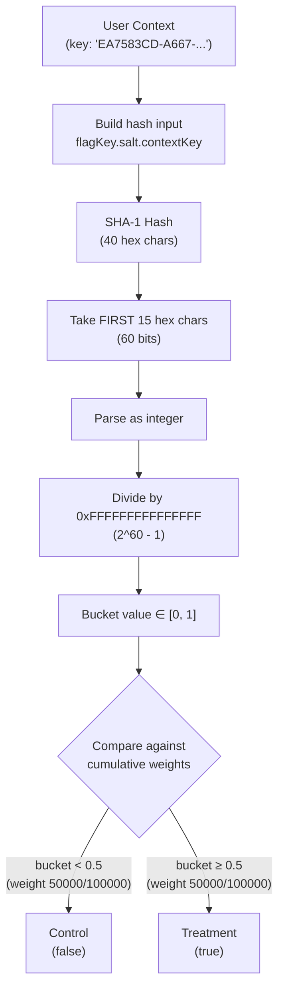
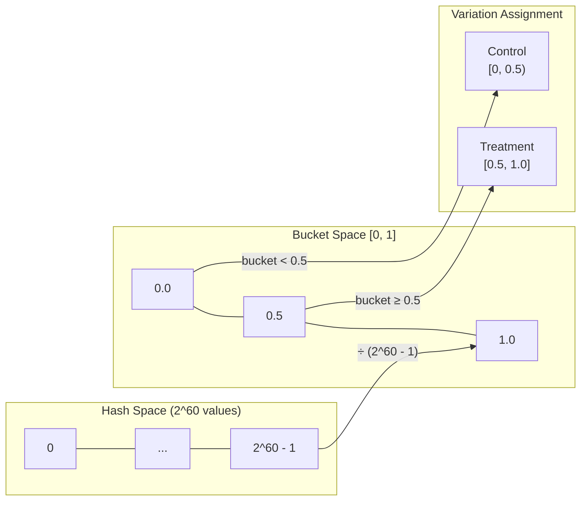
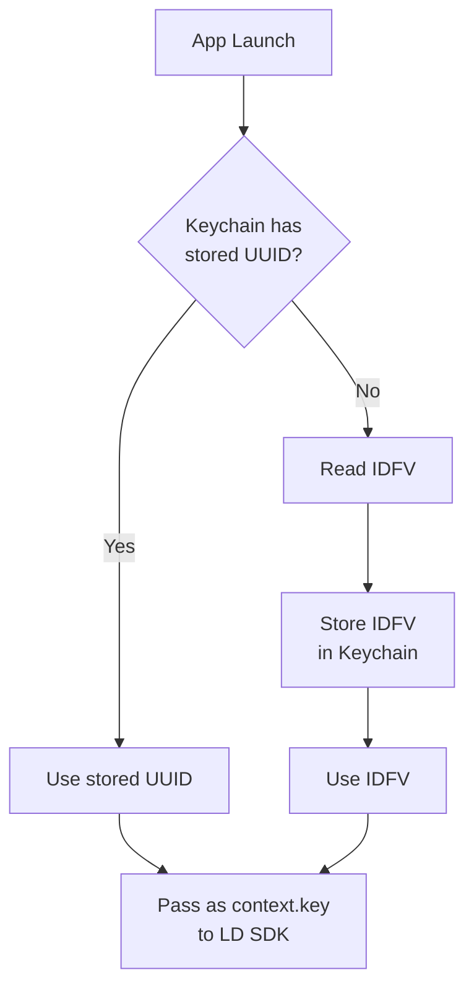
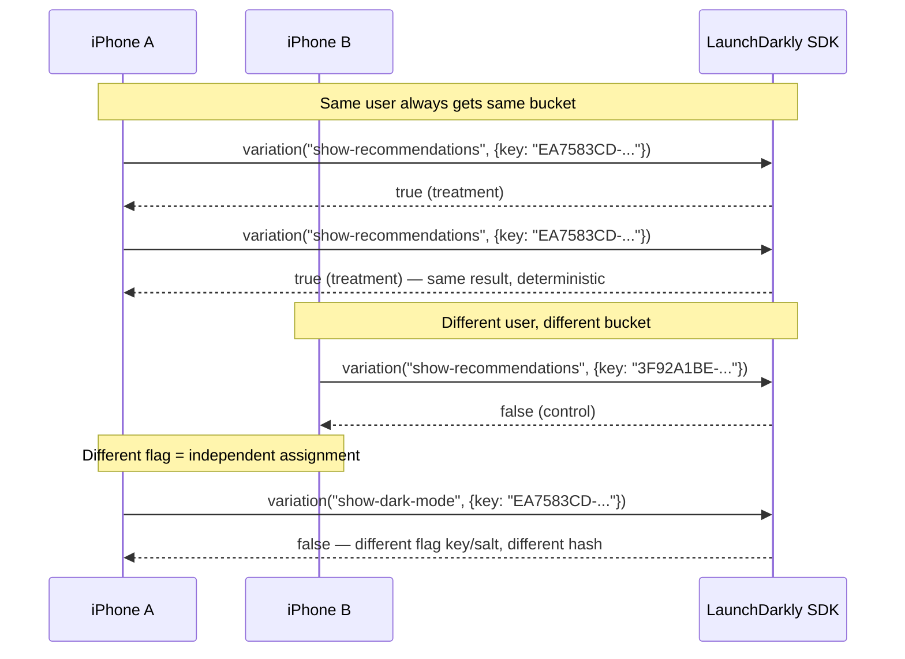

# How LaunchDarkly Assigns Users to Buckets

## The Hashing Mechanism

LaunchDarkly uses a **deterministic hashing algorithm** to assign each user to a variation. This means:

- The same user **always** gets the same variation (no randomness at evaluation time)
- Different users get distributed evenly across variations
- No server-side state is needed to remember assignments

### The Algorithm (from the actual SDK source code)

The following is extracted directly from the installed LD Node.js SDK (`@launchdarkly/js-server-sdk-common/dist/evaluation/Bucketer.js`):

```js
// Actual SDK code (simplified)
const prefix = seed ? Number(seed) : `${flagKey}.${salt}`;
const hashKey = `${prefix}.${contextKey}`;
const hashVal = parseInt(sha1Hex(hashKey).substring(0, 15), 16);
const bucket = hashVal / 0xFFFFFFFFFFFFFFF;  // bucket ∈ [0, 1]
```



### Step by Step

1. **Build the hash input**: `{prefix}.{context.key}`
   - For rollouts: prefix = `"{flagKey}.{salt}"` (e.g. `"show-recommendations.aB3cDeFg"`)
   - For experiments: prefix = `"{seed}"` (an integer seed, e.g. `"61"`)
   - `context.key` = the user's unique identifier (device UUID)

2. **Hash it**: SHA-1 produces a 40-character hex string

3. **Extract bucket value**: Take the **first** 15 hex characters, parse as base-16 integer
   ```
   hashVal = parseInt(sha1hex.substring(0, 15), 16)
   ```
   This yields a 60-bit integer in the range `[0, 2^60 - 1]`.

4. **Normalize to [0, 1]**: Divide by `0xFFFFFFFFFFFFFFF` (which is `2^60 - 1`)
   ```
   bucket = hashVal / 1152921504606846975
   ```

5. **Map to variation**: Walk through the rollout variations, accumulating weights (expressed as fractions of 100,000):
   ```
   sum = 0
   for each variation:
       sum += variation.weight / 100000
       if bucket < sum → assign this variation
   ```
   For a 50/50 split: control gets `bucket < 0.5`, treatment gets `bucket >= 0.5`.

### Consistency Across SDKs

The algorithm is identical in every LD SDK:

| SDK | Hash | Chars | Divisor | Source |
|-----|------|-------|---------|--------|
| **Node.js/TS** | SHA-1 | first 15 hex | `0xFFFFFFFFFFFFFFF` | `Bucketer.js` |
| **Go** (reference) | SHA-1 | first 15 hex | `float32(0xFFFFFFFFFFFFFFF)` | `evaluator_bucketing.go` |
| **Python** | SHA-1 | first 15 hex | `__LONG_SCALE__` = `0xFFFFFFFFFFFFFFF` | `evaluation.py` |

This guarantees that a user with the same key gets the **same variation** regardless of which platform evaluates the flag.

## Why the 50/50 Split Is Mathematically Guaranteed

### The Core Question

> "How can we be sure that hashing arbitrary user keys always produces a fair 50/50 split?"

The answer relies on three properties of cryptographic hash functions.

### Property 1: Avalanche Effect

SHA-1 satisfies the **strict avalanche criterion**: flipping a single input bit changes each output bit with probability ~0.5, independently. This means:

- `SHA1("flag.salt.user-A")` and `SHA1("flag.salt.user-B")` produce outputs that are **statistically independent**
- Similar inputs do **not** produce similar outputs
- The hash output is computationally indistinguishable from a random oracle

### Property 2: Uniform Output Distribution

For any set of distinct inputs, the SHA-1 outputs are uniformly distributed across the output space. The first 60 bits (15 hex chars) used by LD are uniformly distributed in `[0, 2^60 - 1]`.

After dividing by `2^60 - 1`, the bucket value is uniformly distributed in `[0, 1]` with a granularity of:

```
1 / (2^60 - 1) ≈ 8.67 × 10⁻¹⁹
```

This is **10 trillion times finer** than the 1/100,000 granularity of LD's rollout weights.

### Property 3: Negligible Bias from Discretization

The pigeonhole principle could introduce bias when mapping `2^60` values into 100,000 slots:

```
(2^60 - 1) mod 100,000 = 46,975
```

This means 46,975 slots get one extra value out of `2^60`. The maximum per-slot bias is:

```
1 / (2^60 - 1) ≈ 8.67 × 10⁻¹⁹
```

For comparison, if you flip a coin 1 billion times, the expected deviation from 50/50 is ~0.003%. The LD bucketing bias is **15 orders of magnitude smaller** than coin-flip variance.

### Formal Statement

For `N` distinct context keys and a flag with key `f` and salt `s`:

```
b_i = SHA1(f + "." + s + "." + key_i)[0:60bits] / (2^60 - 1)
```

Under the random oracle model, these `b_i` values are independently and uniformly distributed on `[0, 1]`. For any percentage split with granularity `1/100,000`, the expected assignment to each variation matches the configured percentage within `O(1/2^60)` — a bias so small it cannot be observed even with trillions of users.

### Visual Intuition



### What This Means in Practice

With 2,000 simulated users (as in our PoC):

- Expected split: 1,000 control / 1,000 treatment
- Standard deviation: `√(2000 × 0.5 × 0.5) ≈ 22`
- Observed splits typically fall in the range **~960–1040** per variation
- This is normal statistical variance, not a bias in the hash function

The hash guarantees **equal probability** of assignment. It does not guarantee **equal counts** in small samples — that is governed by the binomial distribution.

## iOS Device Identifiers: Best Practices

### Recommended: `identifierForVendor` (IDFV)

For A/B testing and feature flagging, Apple's `identifierForVendor` is the recommended identifier.

```swift
let deviceId = UIDevice.current.identifierForVendor?.uuidString
// Example: "EA7583CD-A667-48BC-B806-42ECB2B48606"
```

| Property | Detail |
|----------|--------|
| **Format** | UUID v4 (RFC 4122): `XXXXXXXX-XXXX-4XXX-YXXX-XXXXXXXXXXXX` |
| **Bits** | 128 total, 122 random (6 fixed: 4 version + 2 variant) |
| **Scope** | Same value for all apps from the same vendor on the same device |
| **Permissions** | None required — available immediately |
| **Persistence** | Stable across app launches, updates, background/foreground cycles |
| **Resets when** | ALL apps from the vendor are uninstalled, then one is reinstalled |

### UUID v4 Format (RFC 4122)

The IDFV follows the standard UUID v4 format:

```
EA7583CD-A667-48BC-B806-42ECB2B48606
│        │    │ │  │
│        │    │ │  └── Variant bits: first hex char is 8, 9, a, or b
│        │    │ └───── Always "4" (version 4 = random UUID)
│        │    └──────── 4-char group
│        └───────────── 4-char group
└────────────────────── 8-char group
```

Structure:

| Field | Bits | Hex Chars | Content |
|-------|------|-----------|---------|
| `time_low` | 32 | 8 | Random |
| `time_mid` | 16 | 4 | Random |
| `time_hi_and_version` | 16 | 4 | `4` + 12 random bits |
| `clock_seq` | 16 | 4 | `10` variant + 14 random bits |
| `node` | 48 | 12 | Random |

The 122 random bits provide `2^122 ≈ 5.3 × 10^36` possible values — collision probability for 1 billion devices is approximately `10^-19`.

### Why NOT to Use IDFA

The `advertisingIdentifier` (IDFA) requires App Tracking Transparency (ATT) consent since iOS 14.5:

```swift
// Requires a prompt the user can deny
ATTrackingManager.requestTrackingAuthorization { status in ... }
```

| Issue | Impact |
|-------|--------|
| Requires user permission | ~75% of users deny tracking |
| Returns all zeros if denied | Can't bucket the user |
| App Store review risk | Using IDFA for non-ad purposes may cause rejection |
| Users can revoke anytime | Mid-experiment identity loss |

### Recommended Pattern for Maximum Stability



```swift
func getStableDeviceId() -> String {
    // Keychain survives app uninstall/reinstall
    if let stored = KeychainHelper.read(key: "ld-device-id") {
        return stored
    }
    let idfv = UIDevice.current.identifierForVendor?.uuidString ?? UUID().uuidString
    KeychainHelper.write(key: "ld-device-id", value: idfv)
    return idfv
}

// Use as LaunchDarkly context key
let context = LDContextBuilder()
context.kind("user")
context.key(getStableDeviceId())
```

Storing in the Keychain ensures the identifier survives a full uninstall/reinstall cycle, preventing re-bucketing.

## Deterministic Consistency



### Key Properties

| Property | How It Works | Why It Matters |
|----------|-------------|----------------|
| **Deterministic** | SHA-1 of fixed input → fixed output | User sees consistent experience across sessions |
| **Uniform** | Cryptographic hash → uniform distribution | 50/50 split is mathematically guaranteed within `O(1/2^60)` |
| **No cross-flag correlation** | Flag key is part of the hash input | Treatment in experiment A does not predict assignment in experiment B |
| **Salt prevents gaming** | Random salt is secret, per-flag | Users cannot predict or manipulate their bucket |
| **Cross-platform** | Same algorithm in all SDKs | iOS, Android, and server evaluations agree for the same user key |

## What About Re-bucketing?

Users stay in their bucket unless:

- The **flag's salt** is changed (rare, admin action — re-randomizes everyone)
- The **user's key** changes (e.g., new device, full reinstall without Keychain)
- The **rollout percentages** change (only affects users near the boundary)
- **Targeting rules** override the rollout (e.g., "all beta testers get treatment")

In production, re-bucketing should be avoided during an active experiment as it contaminates the statistical analysis.
