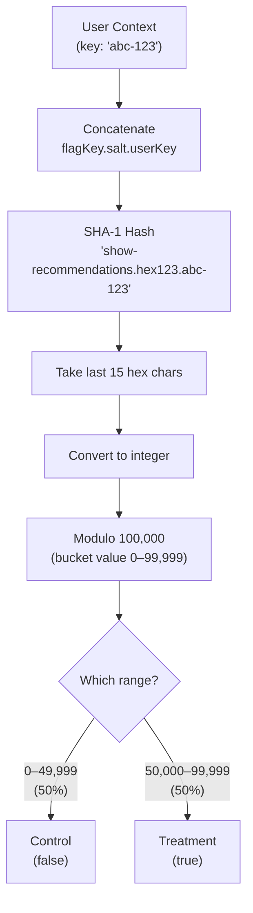
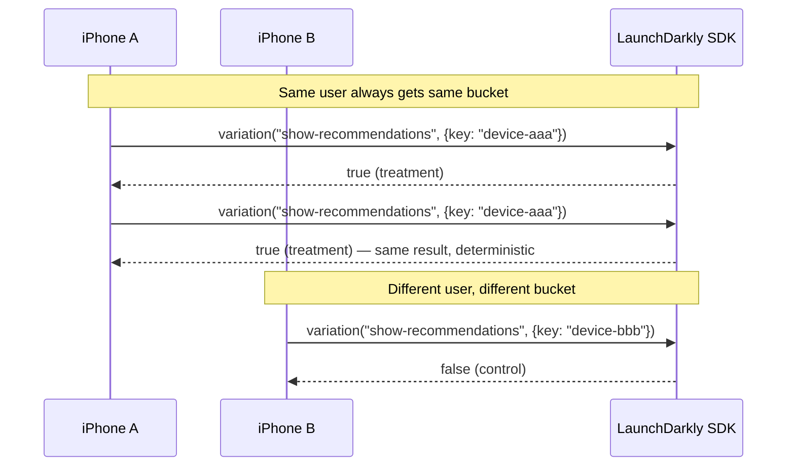

# How LaunchDarkly Assigns Users to Buckets

## The Hashing Mechanism

LaunchDarkly uses a **deterministic hashing algorithm** to assign each user to a variation. This means:

- The same user **always** gets the same variation (no randomness at evaluation time)
- Different users get distributed evenly across variations
- No server-side state is needed to remember assignments

### The Algorithm



### Step by Step

1. **Build the hash input**: `{flagKey}.{salt}.{context.key}`
   - `flagKey` = `"show-recommendations"`
   - `salt` = random hex string generated when the flag was created
   - `context.key` = the user's unique identifier (device UUID in our case)

2. **Hash it**: SHA-1 produces a 40-character hex string

3. **Extract bucket value**: Take the last 15 hex characters, parse as integer, modulo 100,000
   ```
   bucket = parseInt(sha1.substring(25), 16) % 100000
   ```

4. **Map to variation**: Compare the bucket value against the rollout weights
   - 50/50 split → control gets 0–49,999, treatment gets 50,000–99,999
   - 80/20 split → control gets 0–79,999, treatment gets 80,000–99,999

### Why This Matters



### Key Properties

| Property | How It Works | Why It Matters |
|----------|-------------|----------------|
| **Deterministic** | SHA-1 hash of a fixed input | User sees consistent experience across sessions |
| **Uniform distribution** | Hash output is uniformly distributed | 50/50 split means exactly ~50% in each bucket |
| **No cross-flag correlation** | Flag key is part of the hash input | Being in treatment for flag A doesn't predict assignment for flag B |
| **Salt prevents gaming** | Random salt is secret | Users can't predict or manipulate their assignment |

### Practical Implication for iOS

When a user installs the Zeam app:

1. The app generates a persistent **device UUID** (stored in Keychain)
2. This UUID becomes the `context.key` for all LD evaluations
3. The SDK caches the flag state locally — works offline too
4. On app launch, the SDK syncs with LD via streaming connection
5. Flag changes propagate in **< 200ms** to connected clients

### What About Re-bucketing?

Users stay in their bucket unless:

- The **flag's salt** is changed (rare, admin action — re-randomizes everyone)
- The **user's key** changes (e.g., new device, reinstall)
- The **rollout percentages** change (only affects users near the boundary)
- **Targeting rules** override the rollout (e.g., "all beta testers get treatment")

In production, re-bucketing should be avoided during an active experiment as it contaminates the statistical analysis.
