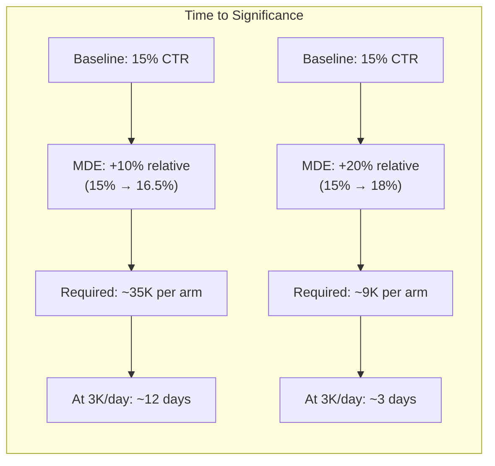
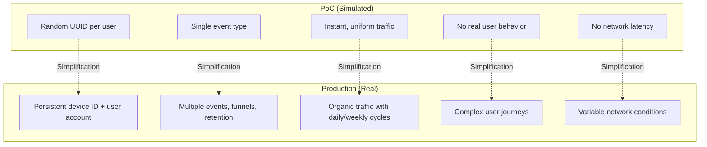

# Success Criteria: Production vs PoC

## PoC Success Criteria

This proof-of-concept is designed to validate **feasibility and stakeholder buy-in**, not production readiness.

| Criteria | Target | How We Measure |
|----------|--------|----------------|
| Flag evaluation works | 100% of simulated users get a variation | Console output shows control/treatment split |
| Real-time dashboard | Events appear on LD dashboard within seconds | Visual during presentation |
| Statistical significance | "Win" scenario reaches >95% confidence | LD Experiments dashboard |
| Inconclusive detection | "Inconclusive" scenario stays below 90% | LD Experiments dashboard |
| Visual demo | Mock iOS UI reacts to flag in real time | Toggle flag in LD, watch UI update |
| Setup automation | One command creates all LD resources | `npm run setup` completes without errors |

## Production Success Criteria

For a real A/B test on the Zeam iOS app with ~20K daily users (iOS fraction estimated at ~5-8K/day):

### Primary Metrics

| Metric | Definition | Measurement | Target MDE |
|--------|-----------|-------------|------------|
| **Content engagement rate** | % of sessions where user taps a content tile | LD custom event + analytics | +10% relative lift |
| **Watch time per session** | Average minutes watched per session | Backend event pipeline | +5% relative lift |
| **Recommendation click-through** | % of users who tap a recommended item | LD custom event | +15% relative lift |

### Guardrail Metrics

These metrics should **not degrade** when the treatment is active:

| Metric | Threshold | Why |
|--------|-----------|-----|
| App crash rate | < 0.1% increase | New UI code could introduce bugs |
| Session duration | No significant decrease | Recommendations shouldn't drive users away |
| Content load time | < 200ms increase | Extra API call for recommendations |
| Scroll depth | No significant decrease | Row insertion shouldn't break scroll behavior |

### Sample Size Requirements (Production)

Given ~6K iOS daily active users and 50/50 split (3K per arm per day):

| Effect Size (relative) | Users per arm | Days at 3K/day | Days at 6K/day |
|------------------------|---------------|----------------|----------------|
| +5% (15% → 15.75%) | ~140,000 | ~47 days | ~23 days |
| +10% (15% → 16.5%) | ~35,000 | ~12 days | ~6 days |
| +20% (15% → 18%) | ~9,000 | ~3 days | ~1.5 days |
| +50% (15% → 22.5%) | ~1,500 | <1 day | <1 day |

### Recommended Experiment Duration

- **Minimum**: 7 days (captures weekly usage patterns)
- **Target**: 14 days (robust against day-of-week effects)
- **Maximum**: 30 days (diminishing returns, opportunity cost)

Even if statistical significance is reached early, run for at least 7 days to account for:
- Day-of-week effects (weekday vs weekend behavior)
- Novelty effects (users engage more with new features initially)
- Primacy effects (users habituated to old UI may initially underperform)

## Known Limitations of This PoC

### Simulation vs Reality

| PoC Limitation | Production Reality | Impact on PoC Validity |
|----------------|-------------------|----------------------|
| Simulated users have no real behavior | Real users have sessions, funnels, retention | PoC proves mechanics, not business outcomes |
| Single conversion event | Multiple events per session | PoC understates LD's analytics capability |
| Traffic arrives in controlled waves | Organic traffic is bursty and cyclical | PoC dashboard behavior is smoother than reality |
| All users are "new" | Mix of new and returning users | PoC doesn't demonstrate user-level persistence |
| No segmentation | Real experiments can target segments | PoC doesn't showcase advanced targeting |
| Fixed conversion probabilities | Real conversion varies by time, segment, device | PoC outcomes are artificially clean |

### What the PoC Does Prove

Despite these limitations, the PoC conclusively demonstrates:

1. **Flag-driven UI control** — the frontend visually shows feature flags working
2. **Statistical rigor** — LD's Bayesian engine produces real confidence intervals
3. **Real-time observability** — stakeholders see the dashboard update live
4. **Operational simplicity** — one command sets up everything, another runs the experiment
5. **Three outcome types** — stakeholders understand win, lose, and inconclusive scenarios
